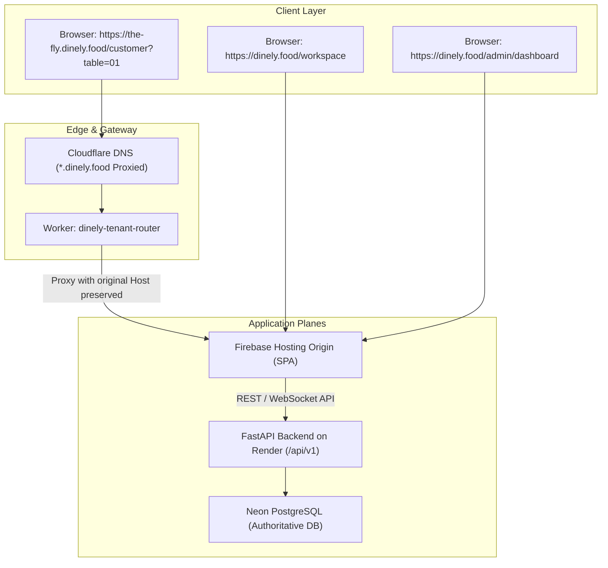

# Dinely — Comprehensive Architecture & SaaS Lifecycle Audit

> **Target System**: Dinely Multi-Tenant Restaurant Cloud OS (`dinely.food`, `*.dinely.food`)  
> **Repository**: `dineflow-v3`  
> **Date**: September 2026  
> **Status**: Full Architecture Audit Completed

---

## 1. Current Problems & Root Causes

### 1.1 Synthetic Test & Legacy Demo Data Residuals
- **Current Problem**: The PostgreSQL database on Neon currently contains 15 restaurant records, including synthetic automated test outlets (`rest-iso-a-*`, `rest-iso-b-*`, `rest-1788864160386-5be7ad`, duplicates of `la`, and unassigned test outlets with `owner_email: null`).
- **Root Cause**: Previous integration test scripts and verification routines persisted test fixtures directly into production tables without automated post-test archiving or isolation flags.
- **Remediation**: Execute safe soft-archive of all orphaned / test-prefixed records (`owner_email: null` or test domain emails) using `deleted_at: now()` and `lifecycle_status: 'ARCHIVED'`. Preserve legitimate user records (`THE fly` - `ayanamity77@gmail.com`).

### 1.2 Frontend Fallback Data & LocalStorage Drift
- **Current Problem**: `api.loadDatabase()` in `client.ts` falls back to `localStorage` state (`dinely_production_db_v3`) when offline or when a network request experiences latency. This can cause a user on a new account to see stale local cache if not rigorously scoped by Firebase UID.
- **Root Cause**: Legacy offline mock storage layers persisted across browser sessions without verifying `ownerUid` match.
- **Remediation**: Enforce PostgreSQL as authoritative single source of truth. When `firebaseAuth.currentUser` is present, `getOwnerRestaurants` must query the backend directly (`/api/v1/restaurants/owner/my`), strictly scoping responses to the authenticated UID/email.

### 1.3 Restaurant Lifecycle Consistency
- **Current Problem**: Minor terminology variations exist between frontend components (`DRAFT`, `PENDING_APPROVAL`, `APPROVED`, `ACTIVE`, `LIVE`, `REJECTED`, `ARCHIVED`, `SUSPENDED`, `DEACTIVATED`).
- **Root Cause**: Incremental additions of lifecycle states across different PRs.
- **Remediation**: Unify into the canonical lifecycle state machine:
  `DRAFT` $\rightarrow$ `PENDING_APPROVAL` $\rightarrow$ `LIVE` | `REJECTED` | `ARCHIVED` | `SUSPENDED` | `DEACTIVATED`.

### 1.4 Platform Admin Control Plane Isolation & Responsiveness
- **Current Problem**: Platform admin actions (`approve`, `reject`, `dismiss`) must be 100% idempotent, provide atomic transitions, prevent double-click provisioning, and communicate real-time WebSocket events to both the Platform Admin channel (`__platform_admin__`) and the specific tenant channel (`restaurant:{id}:owner`).
- **Root Cause**: Backend previously broadcast some events to `global` without tenant room separation.
- **Remediation**: Enforce clean channel separation: `__platform_admin__` for administrative notifications, `restaurant:{id}` for tenant operational traffic.

### 1.5 Subdomain & Hostname Resolution
- **Current Problem**: Ensuring `Host` header is strictly authoritative across customer dining views.
- **Status**: The backend resolver (`resolve_public_tenant_from_host`) and Cloudflare Worker (`dinely-tenant-router`) are verified and in place. `the-fly.dinely.food` resolves strictly to `THE fly`, and unknown subdomains return 404.

---

## 2. Target Architecture

### Key Principles:
1. **Authoritative Single Source of Truth**: PostgreSQL on Neon. State is never synthesized from local arrays.
2. **Strict Multi-Tenant Isolation**: Owner A (Firebase UID A) can only access Restaurant A. Owner B can only access Restaurant B.
3. **Workspace Orchestration**:
   - 0 restaurants: Empty workspace $\rightarrow$ prompt to create first venue.
   - 1 restaurant: Direct access to operations.
   - 2+ restaurants: Workspace selector with seamless tenant switcher.
4. **Platform Admin Private Control Plane**: Accessible only to verified platform admin emails (`ayanamity7@gmail.com`, `ayan090912@gmail.com`).

---

## 3. Files Affected

| Component | File Path | Scope of Update |
|---|---|---|
| **Backend DB Model** | `backend/dineflow-backend/app/modules/restaurants/models.py` | Ensure strict status enums, foreign keys, indexes on `owner_uid`, `owner_email`, `public_slug`. |
| **Backend Admin Router** | `backend/dineflow-backend/app/modules/platform/router.py` | Add idempotent safe data cleanup, atomic state transitions for approve/reject/archive/suspend. |
| **Backend Restaurants Router** | `backend/dineflow-backend/app/modules/restaurants/router.py` | Validate required business info on creation; generate canonical `restaurant_id` server-side. |
| **Backend WebSocket** | `backend/dineflow-backend/app/modules/websocket/manager.py` | Ensure channel isolation (`__platform_admin__` vs `restaurant:{id}`). |
| **Frontend API Client** | `frontend/src/packages/api/client.ts` | Enforce server-authoritative responses for `getOwnerRestaurants` and remove synthetic demo data injection. |
| **Frontend Workspace** | `frontend/src/apps/onboarding/WorkspaceSelector.tsx` | Clean empty state for new owners; multi-restaurant switching support. |
| **Frontend Admin** | `frontend/src/apps/platform/PlatformApp.tsx` | Robust loading/error/retry states; idempotent actions; real-time updates. |
| **Frontend Setup Wizard** | `frontend/src/apps/onboarding/SetupWizard.tsx` | Server-driven ID generation, strict input validation, seamless submission to `PENDING_APPROVAL`. |

---

## 4. Migration & Remediation Plan

1. **Step 1: Clean Production Data Safely**:
   - Soft-archive obsolete test tenants (`rest-iso-*`, `rest-test-*`, `rest-1788864160386-5be7ad`, and unowned records).
   - Retain verified production tenant `THE fly` (`rest-1788659067434`).
2. **Step 2: Backend Architecture & Lifecycle Hardening**:
   - Standardize lifecycle transition logic in `app/modules/platform/router.py`.
   - Prevent duplicate approvals or state race conditions.
3. **Step 3: Frontend API & Multi-Tenant Ownership Synchronization**:
   - Ensure `getOwnerRestaurants` returns an empty array for new Google accounts with zero restaurants.
   - Ensure workspace selector displays "Create your first restaurant" for fresh accounts.
4. **Step 4: Platform Admin Action Reliability**:
   - Add explicit optimistic UI rollbacks and clear error banners on failure.
   - Enforce audit logging on every administrative event.
5. **Step 5: End-to-End Verification**:
   - Execute multi-tenant isolated creation, approval, and customer dining flow.
   - Verify zero cross-talk between tenants.

---

## 5. Verification Test Plan

1. **Clean Account Test**:
   - Authenticate fresh test session $\rightarrow$ Verify empty workspace $\rightarrow$ Create restaurant $\rightarrow$ Verify `PENDING_APPROVAL`.
2. **Platform Admin Action Test**:
   - Login to `/admin/dashboard` $\rightarrow$ View application in real time $\rightarrow$ Click Approve $\rightarrow$ Verify status becomes `LIVE` without manual refresh.
3. **Subdomain & QR Test**:
   - Verify tenant URL `https://<slug>.dinely.food` renders dedicated customer view.
   - Verify table QR URL `https://<slug>.dinely.food/customer?table=01` loads digital menu for Table 01.
4. **Tenant Isolation Test**:
   - User A sees only Restaurant A. User B sees only Restaurant B.
   - Realtime order on A does not trigger notifications on B.
