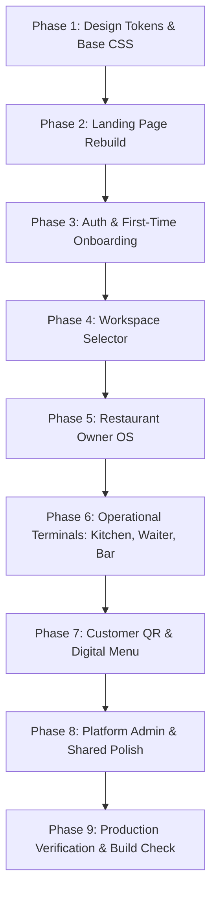

# Dinely — UX & Visual Redesign Roadmap

> **Phase**: Execution Plan & Phase Gates  
> **Standard**: World-Class Product Quality, Zero Generative Tropes, 100% Functionality Preservation

---

## 1. Execution Order & Milestones

---

## 2. Page-by-Page Transformation Details

### Phase 1: Design Tokens & Foundational CSS
- **Files**: `frontend/src/index.css`, `frontend/src/tokens.css` (or embedded variables).
- **Deliverables**:
  - Remove all `.glow-mesh-*` and `.eterna-*` classes.
  - Define CSS custom properties for `--color-bg-canvas`, `--color-bg-surface`, `--color-border-subtle`, `--color-brand-accent`, etc.
  - Set modern typography stacks (`Inter`, `Plus Jakarta Sans`, `JetBrains Mono`).
  - Introduce sharp, high-density elevation tokens.

---

### Phase 2: Landing Page Rebuild (`LandingWebsite.tsx`)
- **Headline**: *"One system for the whole restaurant."*
- **Copy Direction**: Simple, human, confident. Explain how Dinely unites QR menus, staff terminals, kitchen KDS, bar, and billing without proprietary hardware.
- **Visual Storytelling**:
  - Interactive "Live Restaurant Flow" interactive timeline component showing:
    `Guest scans QR` → `Order splits to Kitchen/Bar` → `Waiter alerted in 2s` → `Automated UPI Check`.
  - Replace 60+ generic cards with an editorial, scannable layout.
  - Remove glow blobs, pill badges, and AI statistics.
- **Verification**: Zero 404s, mobile responsiveness across 320px to 1440px.

---

### Phase 3: Login, Signup & First-Time Onboarding (`AuthPage.tsx`, `SetupWizard.tsx`)
- **Login/Signup (`AuthPage.tsx`)**:
  - Minimalist split layout: clean authentication card on left, architectural restaurant photography/statement on right.
  - One-click Google authentication + clear email option.
  - Eliminate all decorative emojis in form buttons and headers.
- **Setup Wizard (`SetupWizard.tsx`)**:
  - Distraction-free, centered onboarding flow.
  - High-precision business type cards (Restaurant / Bar / Food Cart) with distinct active states.
  - Clear 4-step progress indicator without juvenile badges.
  - Live venue preview card that updates in real time.

---

### Phase 4: Workspace Selector (`WorkspaceSelector.tsx`)
- **Transformation**:
  - Strip the `w-[700px] h-[700px] blur-[150px]` background gradient.
  - Calm, editorial grid of owner venues.
  - Replace emoji buttons (`View Status ⏳`, `View Reason ❌`) with clean, elegant status indicators (`Live`, `In Review`, `Changes Requested`).
  - Add quick action: "Onboard another restaurant" with high-craft dashed card.

---

### Phase 5: Restaurant Owner Dashboard (`RestaurantApp.tsx`)
- **Header & Navigation**:
  - Clean desktop header with restaurant logo, live status dot, and tenant domain badge.
  - Organized navigation grouped logically:
    - *Operations*: Overview, Live Orders, Table Map.
    - *Stations*: Kitchen KDS, Waiter Terminal, Bar Terminal.
    - *Management*: Menu Catalog, Staff & Clock-In, Inventory, Billing & Taxes.
- **Overview Metrics**:
  - Replace cards-with-icons with a high-density financial and operational summary (Today's Net, Active Covers, Avg Kitchen Prep Time, Open Tabs).
  - Clean table of recent orders with status pills and 1-click receipts.

---

### Phase 6: Operational Terminals (`KitchenETADashboard.tsx`, `WaiterTerminalOS.tsx`, `BarTerminal.tsx`)
- **Kitchen KDS**:
  - High-contrast, scannable ticket board legible from 10 feet away.
  - Clear elapsed timers (under 10m green, 10-20m amber, >20m red).
  - Touch-friendly large bump controls.
- **Waiter Terminal**:
  - Ergonomic mobile view with thumb-reachable table status triggers.
  - Clean call list (Water, Bill, Service) with precise table tags.
- **Bar Terminal**:
  - Dedicated beverage fulfillment view with drink categorization (Cocktail, Beer, Wine).
  - Batching summaries for high-volume service.

---

### Phase 7: Customer QR & Digital Menu (`CustomerApp.tsx`)
- **Transformation**:
  - Warm, restaurant-branded culinary menu.
  - High-quality dish presentation with clear dietary tags (Veg/Non-Veg icons, allergens).
  - Seamless floating cart bar showing running total and item count.
  - Clean table status tracker without debug panels or emoji buttons.
  - Clear, trustworthy digital bill with itemized tax and one-tap UPI QR.

---

### Phase 8: Platform Admin & Shared Components (`PlatformApp.tsx`, `packages/ui`)
- **Platform Admin**:
  - Clean enterprise audit and approval console.
  - Streamlined approval/rejection modal with direct feedback notes.
- **Shared UI Library**:
  - Harmonize `Button`, `Input`, `Badge`, `Card`, `Modal`, `Table`, `Tabs`, `ToastNotification`.
  - Remove all ad-hoc styles in favor of consistent design tokens.

---

### Phase 9: Production Verification & Build Integrity
- Run `npm run clean && npm run build` to verify zero TypeScript errors.
- Deploy to Firebase Hosting (`firebase deploy --only hosting`).
- Autonomous browser testing across desktop and mobile viewports.
- Confirm backend Render connectivity and WebSocket health.
